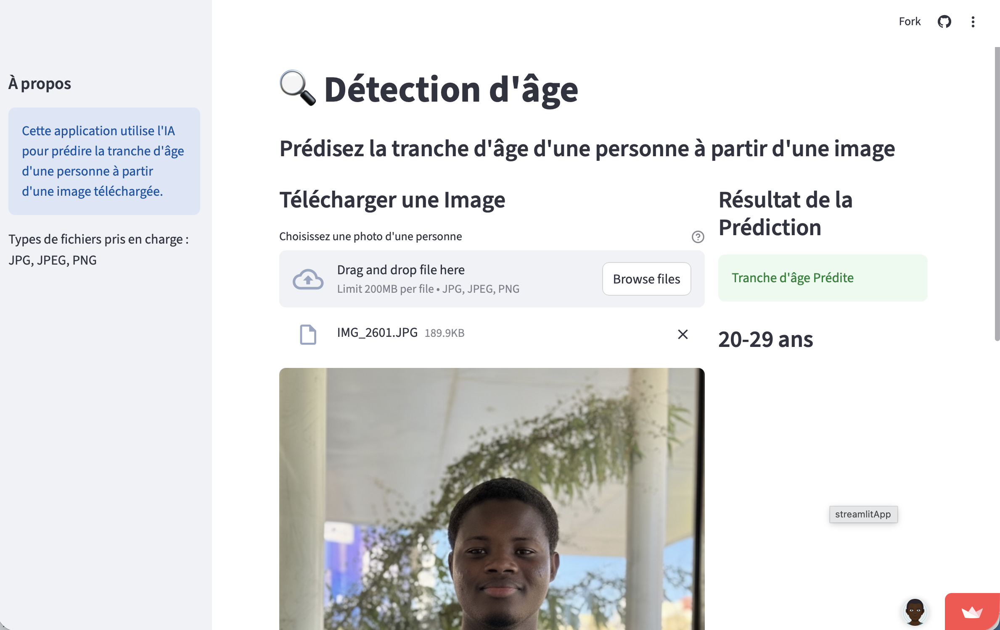

# Age detection API

## Description

API to detect age of a person from an image.

link: [age-detection-app](https://age-detection.streamlit.app)

## Installation

1. Clone the repository
2. Create a virtual environment and install the requirements using the command `python -m virtualenv venv && source venv/bin/activate` and `pip install -r requirements.txt`
3. Run the API using the command `python app/main.py`

4. Run (in another terminal window) the Streamlit UI using: `python -m streamlit run ui/streamlit_app.py`
